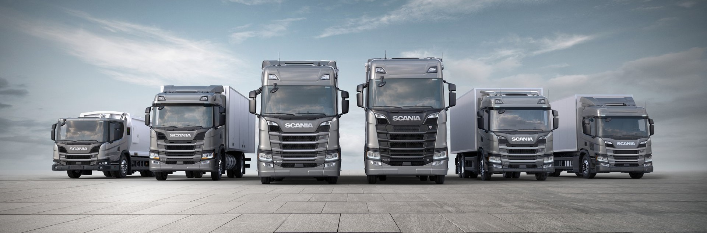

# Scania AB Diagnostics 
by: [Kevin Atkinson](linkedin.com/kevin-m-atkinson)

## Business Understanding
Scania AB is a major Swedish manufacturer. We were founded in 1911. We have
production and assembly facilities in more than 15 countries in four
continents, including Europe, Asia, Africa and South America. We have over
50,000 employees and in 2022 we delivered over 85,000 vehicles with net sales
of over $16B USD.  

All Heavy Scania Trucks come with an APS, or Air Pressure System. The APS
produces high pressure air which is used in various critical functions such
as braking and gear shifting. While undergoing maintainence it's rare that
the APS needs to be repaired. Only 1 in 60 vehicles actually have a faulty APS.

Although it's inexpensive to inspect and repair the APS, the rarity of
failures in the system makes inspecting the APS of all trucks financially
untenebale. However, the cost of sending a vehicle back onto the road which
is soon to fail is approximately 50x more expensive than the inspection and
maintenance itself. Therefore we aim to use sensor data on the vehicle to
flag when the APS is in need of maintenance, with the overall goal of
minimizing repair cost.

In our case, false negatives cost \$500, while false positives cost \$10.

## Data Understanding
Our data is composed of sensor data drawn from 76,000 vehicles in 2016.
107 unique sensors are involved, totaling 170 columns, for a total of nearly
13,000,000 data points. Vehicles with faulty APS are very sparse, consisting
of less than 2% of the total vehicles in the data. This is a challenge for
accurate modeling. Due to the proprietary nature of the APS, sensor
information has been anonymized.

Our training data has ~850,000 null values, composing approximately 8% of all values.

## Data Preparation
We have many object columns as a result of many null values. Our null values are currently formatted as strings of value 'na'. We'll need to convert these to np.nan in order to convert the datatypes of the columns to numerics.

Our target variables are currently strings of values 'pos' for positive class and 'neg' for negative class. We need to convert those to 1 for positive and 0 for negative.

In order to accomplish this we can created two functions. We can use these later in our Pipelines to streamline the process of running new data through our model.

In order to prepare this data, we identified the quantity and location of null values.

It's clear that most of our columns have little to no nulls. However, there are many rows with large amounts of null values. We could drastically reduce our null counts by dropping these rows. In practice, this won't make much sense. Each sample is data pulled from a vehicle undergoing maintenance. It's important that we can actually model the data drawn from any vehicle that enters our shop. In the case of a vehicle whose APS sensors are outputting many null values, you might say we can just inspect their APS by default. This, however, is incorrect, as the pool of rows with many null values is much larger than the pool of our positive class. As a result, we most determine a method for modeling samples with many null values. To solve this problem we'll utilize a KNNImputer, or K-Nearest Neighbors Imputer. This imputer will fill in null values based on their proximity to other values in n-dimensional space.

Finally, we'll scale our data in order to obtain more uniform results across model types. 

## Modeling
Because we know the costs associated with out errors, we were able to create custom cost metrics in order to determine the efficacy of our models. We used this cost function, combined with the models recall score to determine the quality of our models. We then went through an iterative modeling process, using Logistic Regressions, Decision Trees, Random Forests, Grid Searches, as well as using XGBoostClassifier and XGBRFClassifier. 

## Evaluation
In the end, it turned out that a Logistic Regression Model had the best metrics on unseen data. We achieved a custom loss score of $14,400. With further model development we can likely bring that cost to under $10,000.

